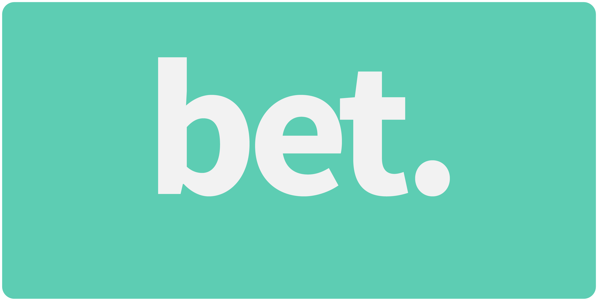

# bet. A social betting app

A platform for betting on anything between friends (even non-friends) and family. Easily bet on who wins on anything and everything.

Visit the app [here](https://betdev.herokuapp.com)

## Table of Contents
- [Introduction](#introduction)
- [User Stories](#user-stories)
- [Tech/Framework Used](#tech/framework-used)
- [Contributors](#contributors)
- [License](#license)

## Introduction

This webapp was developed as a term-long project for our software product development class.

As partners we:
- Identified a problem
    - betting apps primarily revolve around sports
    - lack of accountability for longterm bets
- Wireframed and Scoped our product
- Planned and executed agile sprints
- Pair Programmed

## User Stories

#### MVP Goals
- [x] User can create an account
- [x] User can create bets with other users
- [x] User can view social/personal bets
- [ ] User can comment on bets
- [x] User can check status of bets

#### Stretch Goals
- [ ] User can set bet duration
- [ ] User can upload avatar
- [ ] User can search other users
- [ ] User can like/dislike other
- [ ] User can make bets private

## Tech/Framework Used

- Backend: Express + Node
- Frontend: Bulma + Pug
- Database: MongoDB

## Contributors
- [@lowewenzel](https://github.com/lowewenzel)
- [@tkrain23](https://github.com/tkrain23)

## License
    MIT License

    Copyright (c) 2018 Timothy Kaing & Wenzel Lowe

    Permission is hereby granted, free of charge, to any person obtaining a copy
    of this software and associated documentation files (the "Software"), to deal
    in the Software without restriction, including without limitation the rights
    to use, copy, modify, merge, publish, distribute, sublicense, and/or sell
    copies of the Software, and to permit persons to whom the Software is
    furnished to do so, subject to the following conditions:

    The above copyright notice and this permission notice shall be included in all
    copies or substantial portions of the Software.

    THE SOFTWARE IS PROVIDED "AS IS", WITHOUT WARRANTY OF ANY KIND, EXPRESS OR
    IMPLIED, INCLUDING BUT NOT LIMITED TO THE WARRANTIES OF MERCHANTABILITY,
    FITNESS FOR A PARTICULAR PURPOSE AND NONINFRINGEMENT. IN NO EVENT SHALL THE
    AUTHORS OR COPYRIGHT HOLDERS BE LIABLE FOR ANY CLAIM, DAMAGES OR OTHER
    LIABILITY, WHETHER IN AN ACTION OF CONTRACT, TORT OR OTHERWISE, ARISING FROM,
    OUT OF OR IN CONNECTION WITH THE SOFTWARE OR THE USE OR OTHER DEALINGS IN THE
    SOFTWARE.
